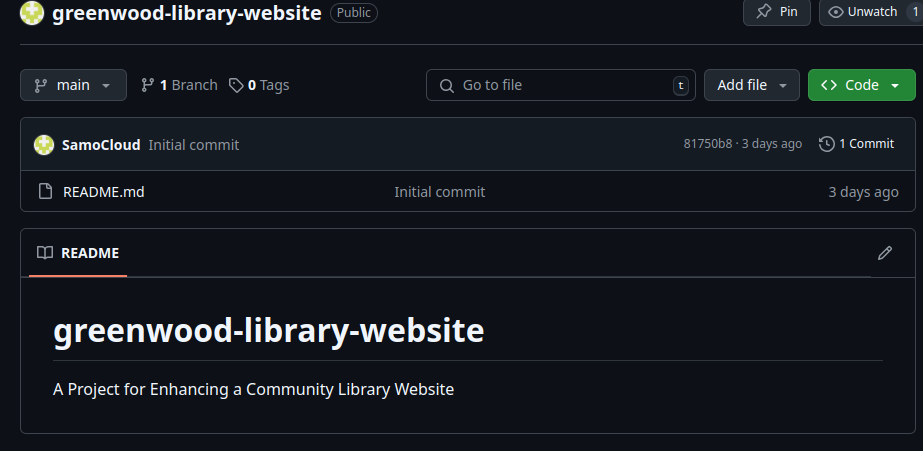
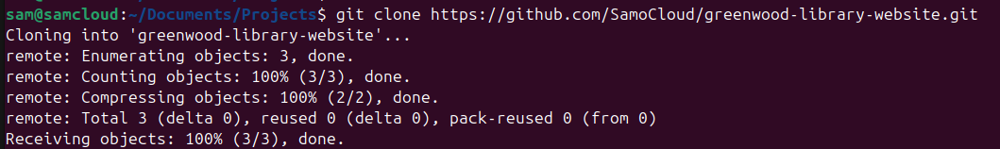

# greenwood-library-website
# A Project for Enhancing a Community Library Website

## To beging with the project, I created a project

### Below is the screeehot for creating the Repository in use.

### I went further to create clone the repo to my main using the following command: git clone

